# Employee Management — Docker & Kubernetes Capstone

A multi-tier **Employee Management** application taken from *runs-on-localhost* all the way to a
**production-style deployment on Google Kubernetes Engine (GKE)** with GitOps via ArgoCD.

Built as the SkillfyMe Kubernetes capstone, covering projects **3.1 – 3.4**:
ReplicaSets & Deployments, Resource Management & HPA, PV/ConfigMap/Secrets/Services, and GitOps with ArgoCD.

> The original developer hand-off (raw localhost source) and the full deployment plan are in
> [`BLUEPRINT.md`](./BLUEPRINT.md).

---

## Architecture

```
                 ┌──────────────── Kubernetes namespace: employee-app ────────────────┐
 Internet        │                                                                     │
    │            │   ┌───────────┐        ┌────────────┐        ┌──────────────────┐   │
    ▼            │   │ frontend  │  /api  │  backend   │  JDBC  │ mysql (StatefulSet│   │
 [LoadBalancer]──────►│ React +   ├───────►│ Spring Boot├────────►│  + PVC)          │   │
                 │   │ nginx     │        │  + HPA     │        └──────────────────┘   │
                 │   └───────────┘        │            │  ┌──────────────────┐         │
                 │                        │            ├──►│ redis (cache)     │        │
                 │                        └────────────┘  └──────────────────┘         │
                 │        ConfigMap (config)  ·  Secret (DB credentials)               │
                 └─────────────────────────────────────────────────────────────────────┘
                                  ▲
                                  │ ArgoCD auto-syncs from git
                          GitHub repo (k8s/ manifests)
```

## Tech stack

| Tier | Technology | Kubernetes workload |
|------|-----------|--------------------|
| Frontend | React 18 + Vite, served by nginx | Deployment + LoadBalancer Service |
| Backend | Spring Boot 3.3 (Java 17) | Deployment + ClusterIP Service + HPA |
| Cache | Redis 7 | Deployment + Service |
| Database | MySQL 8 | StatefulSet + PVC + headless Service |
| Config | ConfigMap + Secret | — |
| GitOps | ArgoCD | Application (auto-sync + self-heal) |

**Images on Docker Hub:** `likith0129/employee-backend:1.0.0` · `likith0129/employee-frontend:1.0.1`

---

## Repository layout

```
.
├── app/
│   ├── backend/     Spring Boot API + Dockerfile.backend
│   └── frontend/    React app + Dockerfile.frontend + nginx.conf
├── db/init.sql      MySQL schema + seed data
├── docker-compose.yml   Local 4-tier smoke test
└── k8s/
    ├── namespace/   config/   mysql/   redis/
    ├── backend/     frontend/ ingress/ argocd/
    └── kustomization.yaml   # kubectl apply -k k8s/
```

---

## Phase 1 — Dockerise (local smoke test)

Multi-stage Dockerfiles for both tiers, wired together with `docker-compose` (MySQL + Redis + backend + frontend)
to prove the images talk to each other before touching Kubernetes.

```bash
docker compose up --build      # app at http://localhost:8085
```

| Images built | Containers running |
|---|---|
| 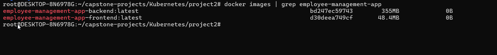 | 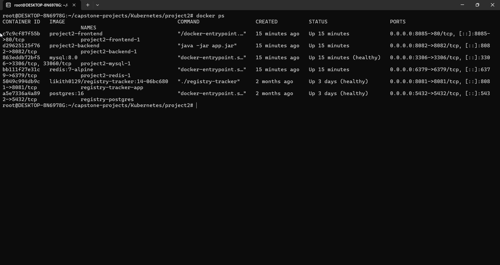 |

| App on localhost | Backend health & logs |
|---|---|
| 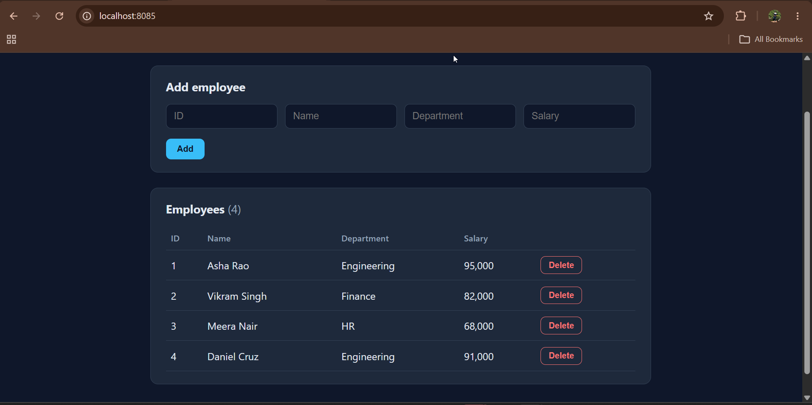 | 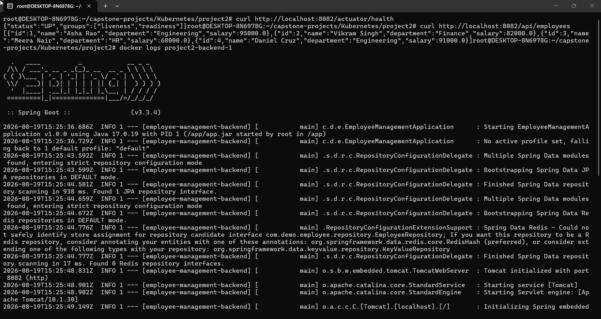 |

---

## Project 3.1 — ReplicaSets & Deployments

Deployments managing the app pods, a bare ReplicaSet demonstrating self-healing, plus scaling, rolling updates and rollback.

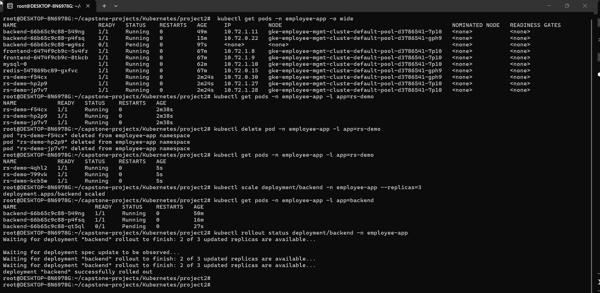

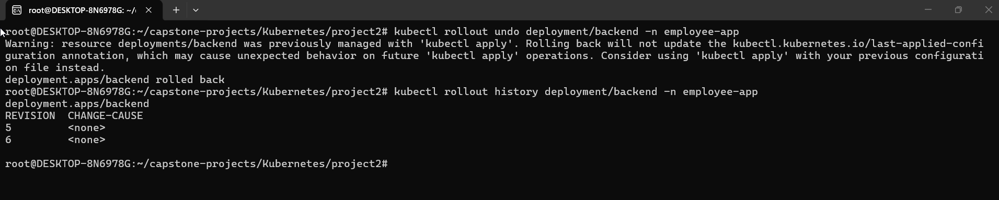

---

## Project 3.2 — Resource Management & Horizontal Pod Autoscaling

CPU/memory **requests & limits** on every pod, plus an **HPA** on the backend (CPU 60%, 2→10 replicas)
that scales automatically under load.

| Resource requests / limits | HPA configuration |
|---|---|
| 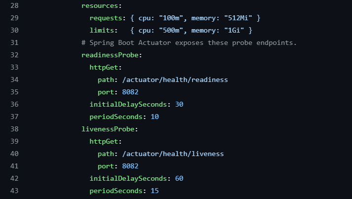 | 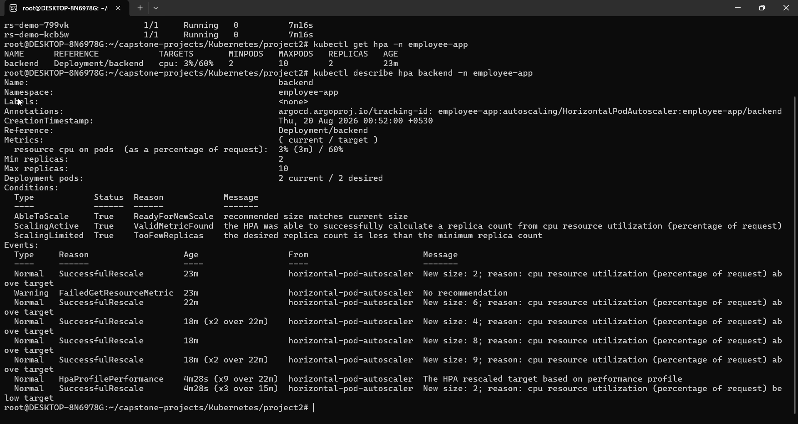 |

**Automatic scaling under load:**

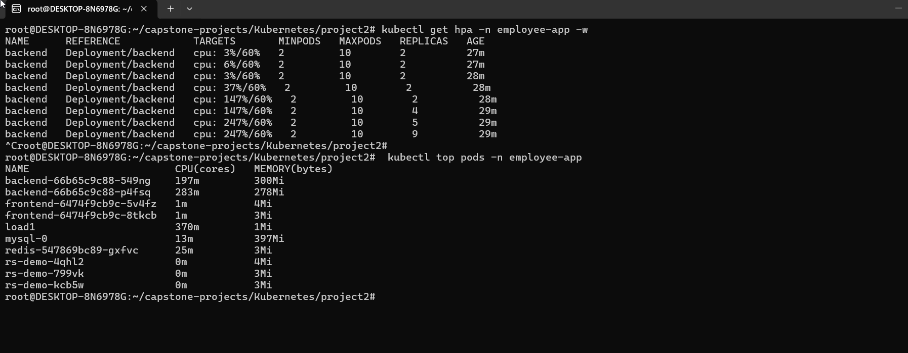

---

## Project 3.3 — PV, ConfigMap, Secrets & Services

MySQL on a **StatefulSet with a PersistentVolumeClaim** (data survives pod restarts), backend config from a
**ConfigMap**, DB credentials from a **Secret**, and the app exposed through a **LoadBalancer Service**.

| Application accessible via Kubernetes | External LoadBalancer |
|---|---|
| 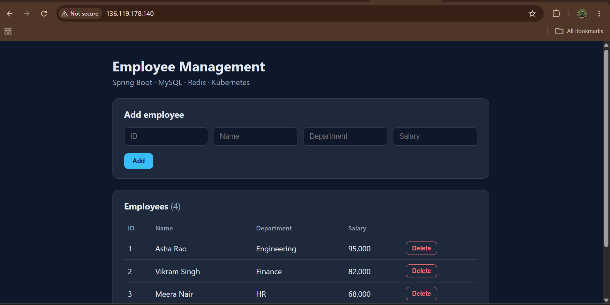 | 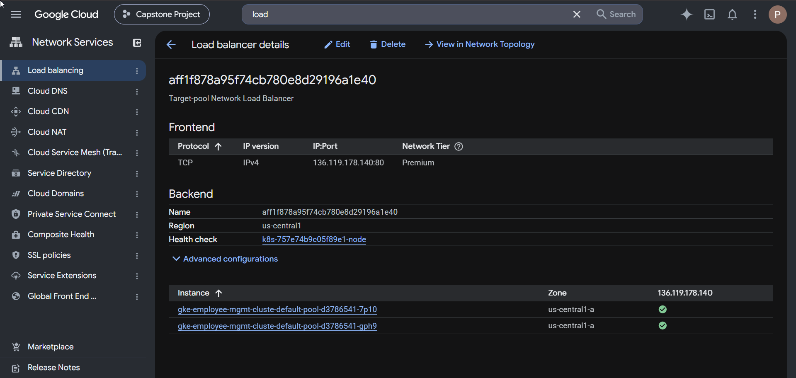 |

Deploy the whole stack in one command:

```bash
kubectl apply -k k8s/
```

---

## Project 3.4 — GitOps with ArgoCD

The `k8s/` folder is the single source of truth. ArgoCD watches this repo and keeps the cluster in sync
(auto-sync + self-heal).

**GKE cluster:**

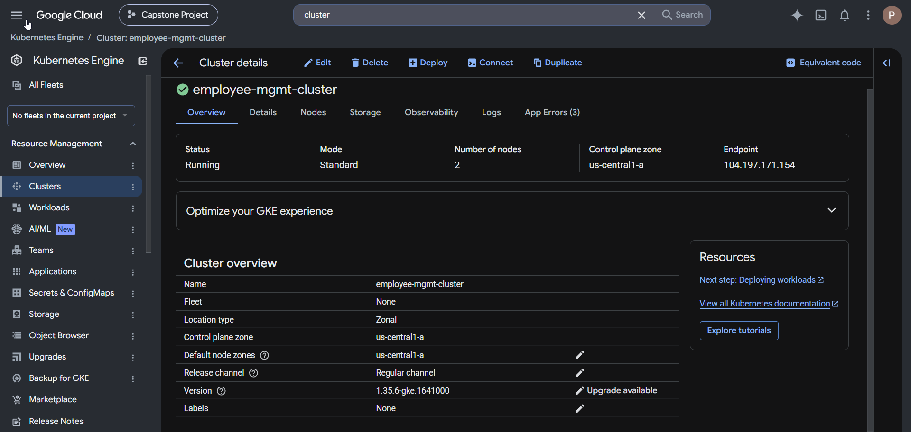

| ArgoCD application | ArgoCD dashboard |
|---|---|
| 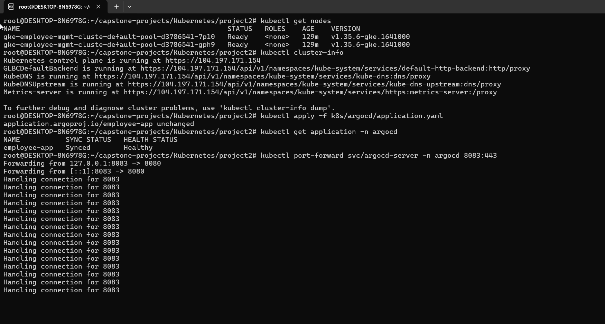 | 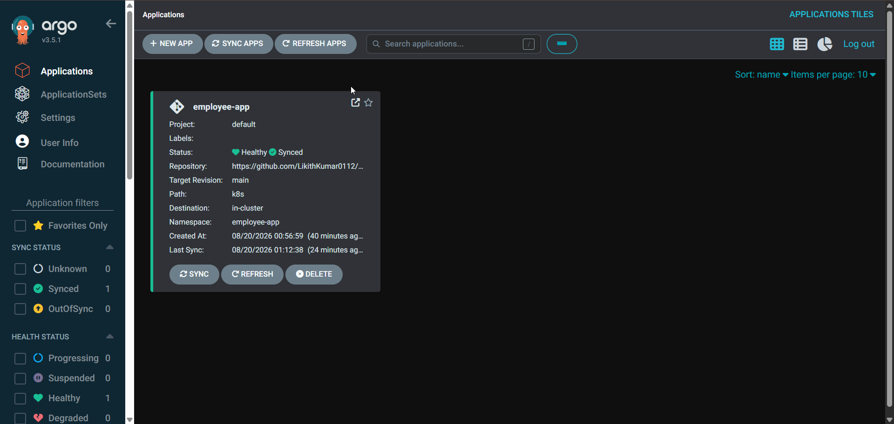 |

```bash
kubectl apply -f k8s/argocd/application.yaml
```

---

## Running it yourself

```bash
# Local (Docker)
docker compose up --build

# Kubernetes (from a configured kubectl context)
kubectl apply -k k8s/
kubectl get pods -n employee-app -w
kubectl get svc frontend -n employee-app        # grab EXTERNAL-IP

# Tear down (stop cloud charges)
kubectl delete -k k8s/
```

## Notes & lessons

Real problems hit during this build — nginx DNS quirks, CPU scheduling on a small cluster, and GCP quota
limits — are written up in plain language in `Troubles-Faced-During-K8s-Implementation.docx`.

Secrets in `k8s/config/db-secret.yaml` are **dummy values for the capstone** — production would use
Sealed Secrets / SOPS / an external secrets manager.
